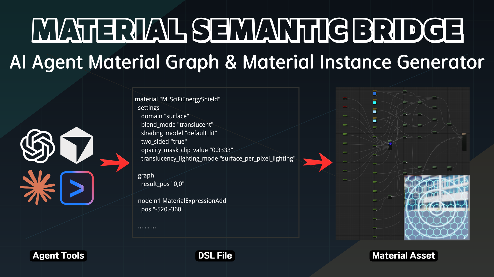
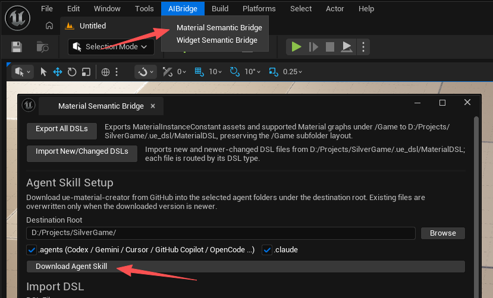
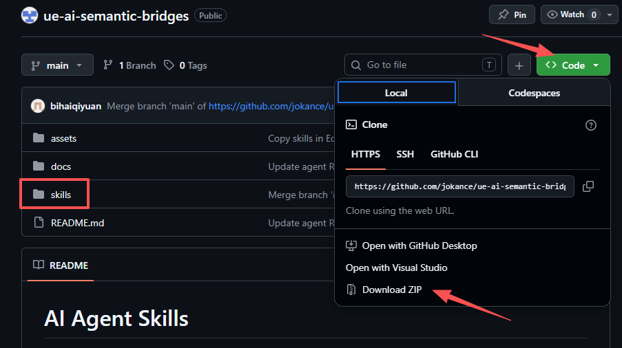
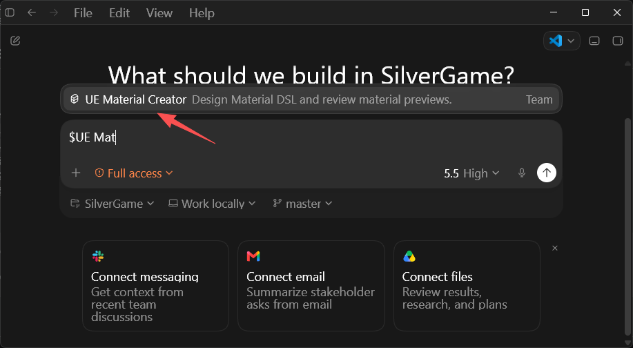
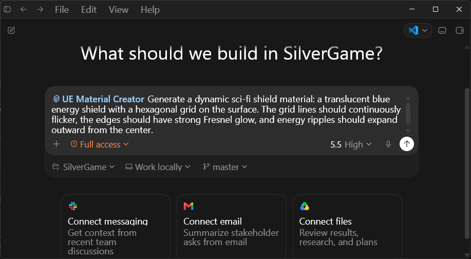
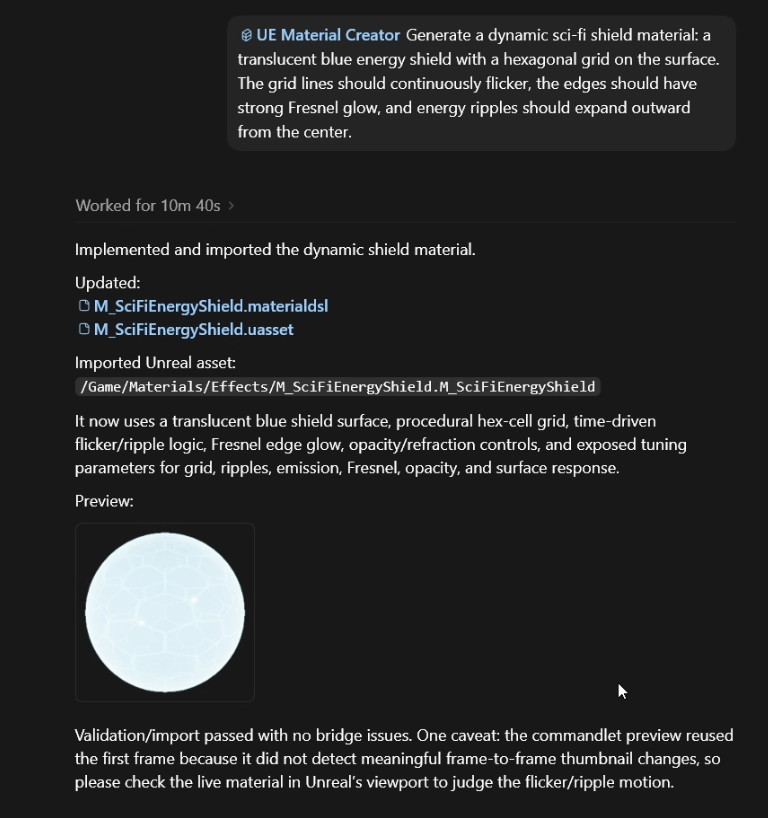

# ue-material-creator ガイド

[English](ue-material-creator.en.md) | [中文](ue-material-creator.cn.md) | 日本語 | [한국어](ue-material-creator.ko.md)

このドキュメントでは、`ue-material-creator` skill と `MaterialSemanticBridge` プラグインを組み合わせて、AI Agent が Unreal マテリアル DSL を生成、検証、正規化、プレビュー、修復、インポート、エクスポートする方法を説明します。



## 概要

`ue-material-creator` は AI Agent 向けのワークフロー skill です。

Unreal のランタイムコードではなく、単体のプラグインでもありません。目的は AI Agent に次の作業手順を与えることです。

- マテリアルのビジュアル要件を分析し、`Material` または `MaterialInstanceConstant` のワークフローを選択する
- サポート済みのインデント形式 `.materialdsl` を生成または編集する
- ドキュメント化された `MaterialExpression*`、プロパティ、pin、マテリアル設定、グラフレイアウト、マテリアル出力のサポート範囲内で作業する
- インポート前に DSL を検証、正規化する
- 正規化フローで生成されたマテリアルプレビュー画像とレポートを読み、AI Agent が見た目を自己評価して `.materialdsl` を修復する
- 安定した DSL を `Material` または `MaterialInstanceConstant` アセットとしてインポートする
- 既存のマテリアルまたはマテリアルインスタンスを DSL にエクスポートし、AI で継続的に反復する

## MaterialSemanticBridge との関係

この構成は 2 つの部分で成り立ちます。

- `MaterialSemanticBridge`: 検証、正規化、プレビュー画像とレポートの生成、インポート、エクスポート、schema 検出、エディタ連携を担当する Unreal Editor プラグイン
- `ue-material-creator`: 要件分析、DSL 生成、プレビュー評価、修復ワークフローを担当する AI Agent skill

プラグインが Unreal 側の処理を実行し、skill が Agent に DSL の書き方、確認方法、プレビュー評価、修復方法を案内します。

## ゲーム開発の効率化における価値

ゲームプロジェクトでは、マテリアルはアートディレクション、レベル環境、パフォーマンス予算、ゲームプレイのフィードバックに合わせて継続的に反復されます。`MaterialSemanticBridge` プラグインと `ue-material-creator` を組み合わせることで、「マテリアル要件を説明する -> DSL を生成する -> 検証 / 正規化する -> プレビュー画像を生成する -> AI が視覚評価して修復する -> Unreal アセットへインポートする」という流れを再現可能なワークフローにでき、手作業でノードを組む時間、パラメータ調整、マテリアルバリエーション整理の負担を減らせます。

主な利点は次の通りです。

- UI、地形、石、金属、布、VFX ベースマテリアルなどのビジュアル方向をより速くプロトタイプできる
- マテリアルのビジュアルメモ、ノードグラフ説明、文章ベースの要件を、インポート可能な `Material` / `MaterialInstanceConstant` アセットにより速く落とし込め、アイデアからエディタアセットまでの情報損失を減らせる
- マテリアルインスタンスのパラメータが `.materialdsl` テキストで表現されるため、AI が同じ親マテリアルの下で色、ラフネス、テクスチャ、静的スイッチなどのバリエーションを一括生成または調整しやすい
- 正規化フローでマテリアルプレビュー画像を生成できる。動的マテリアルでは複数フレームのプレビューも出力できるため、動き、点滅、パン、パルス効果が期待通りかを AI が確認しやすい
- テクニカルアーティストでなくても、この skill とプラグインを使って要件により近いマテリアル表現を作成できる
- 既存のマテリアルやマテリアルインスタンスを一括エクスポートすれば、AI は空のグラフを推測するのではなく、プロジェクト内の実アセットを元に編集を続けられる
- マテリアル DSL はバージョン管理やコードレビューに載せやすく、テクニカルアーティスト、プログラマー、AI Agent が同じ読みやすいテキストを中心に協業できる
- 繰り返しのマテリアル構築、バリエーション生成、同期作業をプラグインと skill に任せることで、開発者はアート判断、パフォーマンス判断、ランタイム表現により多くの時間を使える

## インストール

### 1. プラグインをインストール

プラグインの場所: [MaterialSemanticBridge](https://www.fab.com/listings/cb2fcfbe-a4db-4dee-a9cf-8bbe62823418)

プラグインが Fab から提供される場合、通常は `Install to Engine` で Unreal Engine ディレクトリにインストールします。

`MaterialSemanticBridge` は次の 2 つのインストール形式をサポートします。

- プロジェクトプラグイン: `<Project>/Plugins/MaterialSemanticBridge`
- エンジンプラグイン: `<Engine>/Plugins/.../MaterialSemanticBridge`

インストール後、Unreal Editor で `Edit` -> `Plugins` を開き、`MaterialSemanticBridge` を見つけて有効化してください。

### 2. skill を配置

Unreal Editor で `AIBridge` -> `Material Semantic Bridge` を開き、`Download Agent Skill` を使って skill をプロジェクトにダウンロードします。デフォルトの `Destination Root` はプロジェクトルートですが、`Browse` をクリックして別のフォルダも選べます。



使っている Agent ツールに合わせて配置先を選びます。

- Codex / Gemini CLI / Cursor / GitHub Copilot / OpenCode など `AGENTS.md` 互換の Agent ツール: `.agents/skills/ue-material-creator/`
- Claude Code: `.claude/skills/ue-material-creator/`

[GitHub](https://github.com/jokance/ue-ai-semantic-bridges/tree/main) から ZIP ファイルを直接ダウンロードし、展開後に `skills/ue-material-creator` ディレクトリを対応する `skills` ディレクトリへコピーすることもできます。



チームメンバーや自動化環境で同じワークフロー説明を共有できるよう、プロジェクトリポジトリに含めておくことを推奨します。

## ディレクトリ構成

典型的な構成は次の通りです。

```text
.agents/
  skills/
    ue-material-creator/
      agents/
      references/
      scripts/
      .version
      SKILL.md
```

## 適した用途

適した用途:

- 新しい `.materialdsl` の作成
- 既存 `.materialdsl` の編集
- マテリアルのビジュアルメモや shader graph 説明をインポート可能なマテリアル DSL に変換する
- ノードクラス、プロパティ、pin、マテリアル設定、出力がサポートされているか確認する
- マテリアル DSL を検証、正規化し、プレビュー画像を生成して、プレビュー結果に基づいて修復する
- 既存のマテリアルまたはマテリアルインスタンスを DSL にエクスポートし、AI 編集に戻す
- `/Game` 以下のマテリアル DSL を一括エクスポートする、または新規 / 更新済みの DSL ファイルだけをインポートする

適さない用途:

- ランタイムのマテリアルインスタンスパラメータ変更
- サポート範囲外の任意 HLSL。DSL に入れるべきなのはサポート済みの `MaterialExpressionCustom` 用法のみです
- Niagara、UMG、Blueprint、Sequencer、MetaSound DSL
- 無関係な Unreal C++ 変更

## AI Agent での使い方

推奨ワークフロー:

1. リポジトリルートを Agent の作業ディレクトリにする。
2. `ue-material-creator` skill を使うよう Agent に明示する。
3. `.materialdsl` の生成または変更を依頼する。
4. 正規化フローの実行を依頼する。このフローはまず DSL を検証し、成功後に正規化済み DSL を生成し、レンダリングが利用可能な場合はマテリアルプレビュー画像を出力します。
5. Agent にプレビュー画像または複数フレームのプレビューを読ませ、要件と照らしてマテリアル効果を自己評価させる。見た目が期待と異なる場合は DSL を修復して再度正規化する。
6. DSL とプレビュー効果の両方が通ったら、安定した DSL を Unreal にインポートさせる。

例（Codex）:

1. `$` 記号で `UE Material Creator` skill を選択し（Codex の作業ディレクトリ配下に skill が正しく配置されていることを確認）、選択後に Enter を押します。

2. 任意のマテリアル生成または変更要件を入力します。

3. 残りの作業は AI に任せます。  


他の Agent ツールを使う場合も考え方は同じです。まず `ue-material-creator` を使うよう明示し、その後にマテリアルの説明、マテリアルプレビューを生成するか、DSL を Unreal アセットとしてインポートするかを伝えます。

## 出力

主な出力:

- DSL ファイル: `.ue_dsl/MaterialDSL/.../*.materialdsl`
- インポートされたマテリアル: `/Game/.../M_*`
- インポートされたマテリアルインスタンス: `/Game/.../MI_*`
- 正規化、検証、インポート、エクスポートのレポート
- マテリアルプレビュー PNG: `Saved/MaterialSemanticBridge/MaterialDSLPreview/...`

静的マテリアルは通常 1 枚のプレビュー画像を出力します。時間駆動の式を含む動的マテリアルでは、複数フレームのプレビューが出力される場合があります。

## エディタパネル

プラグインを有効化した後、メインパネルは次から開けます。

- メインメニュー: `AIBridge` -> `Material Semantic Bridge`

パネルは統一ルーティングを使います。

- `Export All DSLs`: `/Game` 以下の `MaterialInstanceConstant` とサポート済み `Material` グラフをエクスポートし、`/Game` のサブディレクトリ構造を維持します
- `Import New/Changed DSLs`: 新規または更新された DSL ファイルをインポートし、DSL 種別に応じて対象リソースへ振り分けます
- `Import DSL`: 単一の `.materialdsl` を検証し、自動マッピングされた対象アセットにインポートします
- `Export DSL`: 選択した `Material` または `MaterialInstanceConstant` を対応する `.materialdsl` にエクスポートします

単一ファイルでもバッチでも、ユーザーが「マテリアルインスタンス」か「マテリアルグラフ」かを手動で選ぶ必要はありません。プラグインが DSL の内容または選択されたアセット種別から自動で分岐します。
