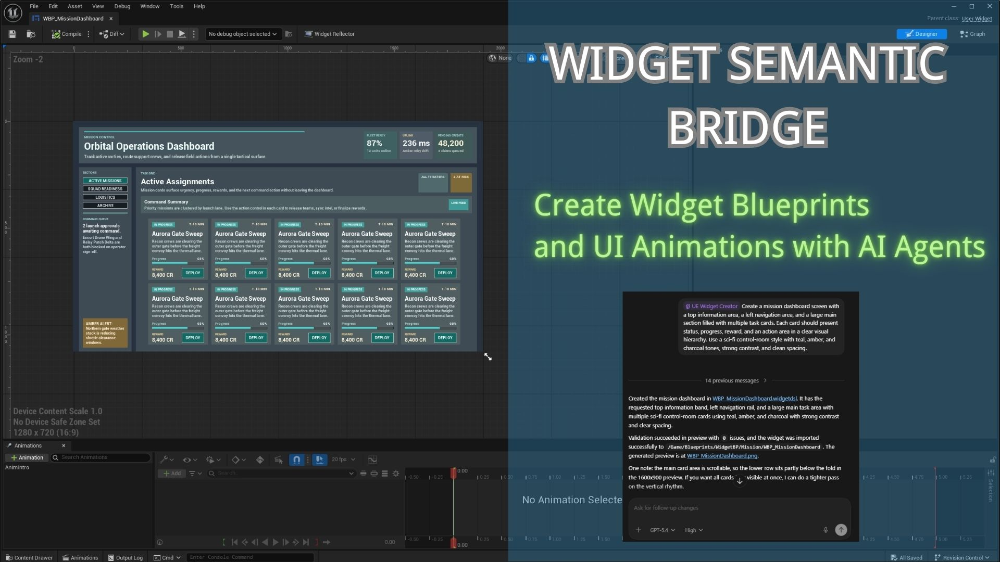
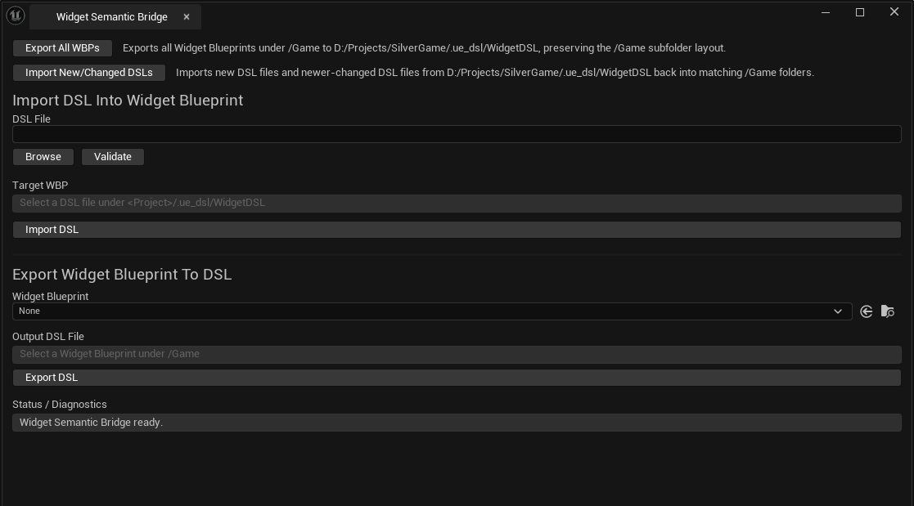

# ue-widget-creator 使用说明

本文档介绍如何配合 `WidgetSemanticBridge` 插件使用 `ue-widget-creator` skill，让 AI Agent 生成静态界面、控件动画 DSL，并完成校验、预览和导入 UMG Widget Blueprint。



## 这是什么

`ue-widget-creator` 是一个给 AI Agent 使用的工作流 skill。

它本身不是 Unreal 运行时代码，也不是单独的插件。它的作用是指导 AI Agent：

- 分析界面需求
- 把需求转换成受支持的 `.widgetdsl`
- 限制生成范围在 `WidgetSemanticBridge` 已支持的控件、属性、Slot 和动画轨道之内
- 生成或修改动画 `animation` / `track` 段落
- 在导入前执行校验和预览
- 将校验后的 DSL 导入为 Unreal 中真实的 `WBP_*`

## 与 WidgetSemanticBridge 的关系

这套方案由两部分组成：

- `WidgetSemanticBridge`：Unreal Editor 插件，负责校验、预览、导入
- `ue-widget-creator`：AI Agent skill，负责需求分析和 DSL 生成流程

插件负责执行，skill 负责工作流。

## 对游戏开发提效的价值

在游戏项目里，UI 往往需要随着玩法、数值和平面设计反馈反复调整。使用 `WidgetSemanticBridge` 插件配合 `ue-widget-creator` 后，可以把“描述需求 -> 生成 DSL -> 校验 / 预览 -> 导入蓝图”串成一条可重复执行的流程，从而减少大量手工搭界面和反复点击编辑器的时间。

它带来的直接收益通常包括：

- 更快做出 UI 原型，方便尽早验证背包、主菜单、任务面板、弹窗等功能界面
- 设计稿、草图或文字说明可以更快落成可导入的 Widget Blueprint，减少实现链路中的信息损耗
- 由于界面布局和部分动画已经以 `.widgetdsl` 文本形式表达，AI 可以更容易理解、生成和修改对应的界面描述，从而加快界面交互、状态切换和流程调整这类工作的迭代速度
- 在导入前先做校验和预览，能更早发现不受支持的控件、属性或布局问题，降低返工成本
- 批量生成或修改 `.widgetdsl` 时更适合多人协作和自动化流程，便于把 UI 资产纳入版本管理
- UI 结构性工作交给插件和 skill 处理后，开发者可以把更多时间放在玩法逻辑、交互细节和运行时行为实现上

## 安装方式

### 1. 安装插件

如果插件来自 Fab，通常是通过 `Install to Engine` 安装到 Unreal 引擎目录。

`WidgetSemanticBridge` 同时支持两种安装方式：

- 项目插件：`<Project>/Plugins/WidgetSemanticBridge`
- 引擎插件：`<Engine>/Plugins/.../WidgetSemanticBridge`

安装后需要在项目中启用该插件：在 Unreal Editor 中，进入 `Edit` -> `Plugins`，找到 `WidgetSemanticBridge` 并勾选启用。

### 2. 放置 skill

`ue-widget-creator` 根据使用的 Agent 工具选择位置：

- Codex / Gemini CLI / GitHub Copilot: `.agents/skills/ue-widget-creator/`
- Claude Code: `.claude/skills/ue-widget-creator/`

推荐优先放在项目仓库中，这样团队成员和自动化环境可以共享同一份工作流说明。

## 目录结构

典型结构如下：

```text
.agents/
  skills/
    ue-widget-creator/
      SKILL.md
      references/
      scripts/
```

## 适用场景

适合用于：

- 根据文字、设计稿、草图等需求生成 UMG 界面
- 根据设计图或说明补写 `.widgetdsl`
- 修改已有 `.widgetdsl`
- 为受支持的控件生成或修改动画轨道
- 在导入前确认某个控件、属性或动画轨道是否受支持
- 将 DSL 批量校验并导入为 Widget Blueprint

不适合用于：

- Event Graph 逻辑生成
- 运行时 Binding 或 Delegate
- 不在支持面内的任意自定义控件

## AI Agent 应该怎么用这个 skill

无论是 `Claude Code`、`Codex` 还是 `Gemini CLI`，核心要求都一样：

- Agent 能访问项目仓库
- Agent 能执行本地脚本或 commandlet（执行过程中 Agent 可能会要求运行命令授权）

推荐操作方式：

1. 将仓库根目录作为 Agent 的工作目录
2. 明确告诉 Agent 使用 `ue-widget-creator` skill
3. 让 Agent 生成或修改 `.widgetdsl`
4. 让 Agent 生成或修改控件动画
5. 让 Agent 先执行 validate / preview
6. 让 Agent 导入 DSL 并生成 Widget Blueprint

### 示例

```shell
cd /path/to/your/project
codex
$ue-widget-creator Create a full-screen inventory widget with a 4x7 item slot grid on the left and an item details panel on the right.
```

如果你使用的是其他 Agent 工具，也可以用同样的思路表达需求：先明确要求使用 `ue-widget-creator`，再给出界面描述、布局要求和是否需要动画或导入蓝图。

## 输出结果

常见输出包括：

- DSL 文件：`.ue_dsl/WidgetDSL/.../WBP_*.widgetdsl`
- 含动画的 DSL 文件：同样保存在 `.ue_dsl/WidgetDSL/.../WBP_*.widgetdsl`
- 预览图：`Saved/WidgetDSLPreview/.../*.png`
- 导入后的蓝图：项目 `/Game/.../WBP_*`

## 编辑器面板使用说明

启用插件后，可以通过以下入口打开主面板：

- 主菜单：`AIBridge` -> `Widget Semantic Bridge`

如果你只是想从现有 Widget Blueprint 单独导出 DSL，也可以在 Content Browser 中右键某个 Widget Blueprint，使用 `Export To Widget DSL`。



这个面板主要分为四块：

### 1. 批量导出 / 批量导入

面板顶部的两个按钮用于整个项目范围内的批处理：

- `Export All WBPs`：把 `/Game` 下的 Widget Blueprint 批量导出到 `<Project>/.ue_dsl/WidgetDSL`，并保留 `/Game` 下原有的子目录结构
- `Import New/Changed DSLs`：从 `<Project>/.ue_dsl/WidgetDSL` 批量导入 DSL，只处理“新文件”或“比当前蓝图更新且内容有变化”的 DSL

适合在多人协作、批量同步或 AI 已经生成了多份 `.widgetdsl` 时使用。

### 2. 单文件导入：`Import DSL Into Widget Blueprint`

用于把一个 `.widgetdsl` 导入成 Unreal 里的 Widget Blueprint。

- 先在 `DSL File` 里选中目标文件，建议先点 `Validate`
- `Target WBP` 会自动显示导入目标
- 确认无误后点击 `Import DSL`

注意：DSL 文件需要放在 `<Project>/.ue_dsl/WidgetDSL` 下，否则面板无法自动映射目标蓝图路径。

### 3. 单文件导出：`Export Widget Blueprint To DSL`

用于把现有 Widget Blueprint 导出回 `.widgetdsl`。

- 在 `Widget Blueprint` 中选择 `/Game` 下的目标资源
- `Output DSL File` 会自动显示输出路径
- 点击 `Export DSL` 执行导出

适合在 UMG 里手动调整完界面后，把结果同步回 DSL 继续交给 AI 修改或纳入版本管理。

## 使用限制

- 这套工作流不是任意 UMG 自由生成器，仍有部分控件、属性、Slot 和动画不支持
- 当前动画生成仅限 `WidgetSemanticBridge` 已实现的动画轨道，不支持任意自定义轨道
- 某些资源类或高级动画能力仍未开放，例如部分 brush resource / material 动画、一些通用 slot 动画等
- 复杂运行时逻辑仍需人工实现
