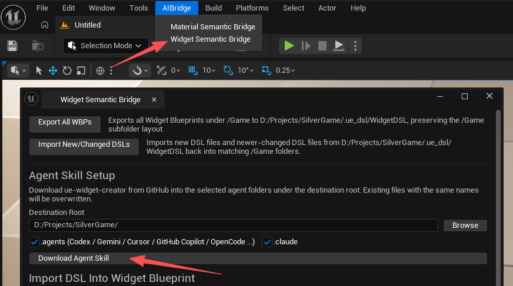

# ue-widget-creator Guide

This document explains how to use the `ue-widget-creator` skill together with the `WidgetSemanticBridge` plugin so an AI Agent can generate static UI and widget animation DSL, then validate, preview, and import it into UMG Widget Blueprints.


## What It Is

`ue-widget-creator` is a workflow skill for AI Agents.

It is not Unreal runtime code, and it is not a standalone plugin. Its purpose is to guide an AI Agent to:

- analyze UI requirements
- convert requirements into supported `.widgetdsl`
- keep generation within the widgets, properties, slots, and animation tracks supported by `WidgetSemanticBridge`
- generate or edit `animation` / `track` sections
- run validation and preview before import
- import validated DSL as real `WBP_*` assets in Unreal

## Relationship With WidgetSemanticBridge

This setup consists of two parts:

- `WidgetSemanticBridge`: the [Unreal Editor plugin](https://www.fab.com/listings/92270793-0b09-406a-81b9-d6f9f307044f) responsible for validation, preview, and import
- `ue-widget-creator`: the AI Agent skill responsible for requirement analysis and the DSL generation workflow

The plugin executes the work. The skill defines the workflow.

## Value for Game Development Productivity

In game projects, UI often needs repeated iteration as gameplay, balancing, and visual design feedback change. Using the `WidgetSemanticBridge` plugin together with `ue-widget-creator` turns “describe requirements -> generate DSL -> validate / preview -> import blueprint” into a repeatable workflow, reducing a large amount of manual UI assembly and repeated editor clicking.

Typical direct benefits include:

- Faster UI prototyping for inventory, main menu, quest panels, popups, and other functional screens
- Design mockups, sketches, or written descriptions can become importable Widget Blueprints more quickly, reducing information loss during implementation
- Because UI layout and some animations are expressed as `.widgetdsl` text, AI can more easily understand, generate, and modify the corresponding UI description, speeding up iteration on UI interactions, state transitions, and flow adjustments
- Generated or re-exported DSL can also be handed directly to AI for UI logic authoring; after WBP changes, exporting DSL again lets AI adjust logic code against the latest UI, usually without manually writing UI code line by line. This is also more recommended with scripting languages such as Lua, TypeScript, or Python, rather than writing large amounts of UI logic in C++ or Blueprint
- Validation and preview before import can catch unsupported widgets, properties, or layout issues earlier, reducing rework cost
- Batch generation or modification of `.widgetdsl` is better suited to team collaboration and automation workflows, making UI assets easier to bring into version control
- After structural UI work is handled by the plugin and skill, developers can spend more time on gameplay logic, interaction details, and runtime behavior implementation

## Installation

### 1. Install the Plugin

Plugin link: [WidgetSemanticBridge](https://www.fab.com/listings/92270793-0b09-406a-81b9-d6f9f307044f)

If the plugin comes from Fab, it is usually installed into the Unreal Engine directory with `Install to Engine`.


`WidgetSemanticBridge` supports both installation modes:

- project plugin: `<Project>/Plugins/WidgetSemanticBridge`
- engine plugin: `<Engine>/Plugins/.../WidgetSemanticBridge`

After installation, enable the plugin in your project: in Unreal Editor, go to `Edit` -> `Plugins`, find `WidgetSemanticBridge`, and enable it.

### 2. Place the Skill

In Unreal Editor, open `AIBridge` -> `Widget Semantic Bridge`, then use `Download Agent Skill` to download the skill into your project. The default `Destination Root` is the project root, but you can click `Browse` to choose another folder:



Keep the target that matches the Agent tool you use:

- Codex / Gemini CLI / Cursor / GitHub Copilot / OpenCode and other `AGENTS.md`-compatible Agent tools: `.agents/skills/ue-widget-creator/`
- Claude Code: `.claude/skills/ue-widget-creator/`

You can also download the ZIP file directly from [GitHub](https://github.com/jokance/ue-ai-semantic-bridges/tree/main), unzip it, and copy the `skills/ue-widget-creator` directory into the corresponding `skills` directory:


It is recommended to keep it in the project repository so teammates and automation environments can share the same workflow instructions.

## Directory Structure

A typical layout looks like this:

```text
.agents/
  skills/
    ue-widget-creator/
      agents/
      references/
      scripts/
      .version
      SKILL.md
```

## Suitable Use Cases

Good fits:

- generating UMG UI from text, design mockups, sketches, and other requirements
- writing `.widgetdsl` based on a design image or description
- modifying existing `.widgetdsl`
- generating or modifying animation tracks for supported widgets
- checking whether a widget, property, or animation track is supported before import
- validating DSL in batch and importing it as Widget Blueprints

Not suitable for:

- Event Graph logic generation
- runtime Binding or Delegate
- arbitrary custom widgets outside the support surface

## How an AI Agent Should Use This Skill

Recommended workflow:

1. Use the repository root as the Agent working directory
2. Explicitly tell the Agent to use the `ue-widget-creator` skill
3. Ask the Agent to generate or modify `.widgetdsl`
4. Ask the Agent to generate or modify widget animations
5. Ask the Agent to run validate / preview first
6. Ask the Agent to import the DSL and generate the Widget Blueprint


Based on my experience, GPT-5.4+ models generate better UI results than other models. If another model does not produce the result you want, try GPT-5.4+.

### Example

```shell
cd /path/to/your/project
codex
$ue-widget-creator Create a full-screen inventory widget with a 4x7 item slot grid on the left and an item details panel on the right.
```

If you use a different Agent tool, the same idea still applies: first explicitly ask it to use `ue-widget-creator`, then provide the UI description, layout requirements, and whether animation or blueprint import is needed.

## Outputs

Common outputs include:

- DSL files: `.ue_dsl/WidgetDSL/.../WBP_*.widgetdsl`
- DSL files with animation: also stored in `.ue_dsl/WidgetDSL/.../WBP_*.widgetdsl`
- preview images: `Saved/WidgetDSLPreview/.../*.png`
- imported blueprints: project `/Game/.../WBP_*`

## Editor Panel Guide

After enabling the plugin, you can open the main panel from:

- main menu: `AIBridge` -> `Widget Semantic Bridge`

If you only want to export a single existing Widget Blueprint to DSL, you can also right-click a Widget Blueprint in the Content Browser and use `Export To Widget DSL`.


The panel is mainly divided into four parts:

### 1. Batch Export / Batch Import

The two buttons at the top are for project-wide batch operations:

- `Export All WBPs`: batch-exports Widget Blueprints under `/Game` to `<Project>/.ue_dsl/WidgetDSL`, preserving the original `/Game` subdirectory structure
- `Import New/Changed DSLs`: batch-imports DSL from `<Project>/.ue_dsl/WidgetDSL`, processing only “new files” or DSL files that are “newer than the current blueprint and have changed content”

This is useful for team collaboration, batch synchronization, or when AI has already generated multiple `.widgetdsl` files.

### 2. Single-File Import: `Import DSL Into Widget Blueprint`

This imports a single `.widgetdsl` as a Widget Blueprint in Unreal.

- Select the target file in `DSL File`; it is recommended to click `Validate` first
- `Target WBP` automatically shows the import target
- After confirming everything is correct, click `Import DSL`

Note: the DSL file must be placed under `<Project>/.ue_dsl/WidgetDSL`; otherwise the panel cannot auto-map the target blueprint path.

### 3. Single-File Export: `Export Widget Blueprint To DSL`

This exports an existing Widget Blueprint back to `.widgetdsl`.

- Select the target asset under `/Game` in `Widget Blueprint`
- `Output DSL File` automatically shows the output path
- Click `Export DSL` to perform the export

This is useful when you manually adjust the UI in UMG and want to sync the result back into DSL for further AI editing or version control.
