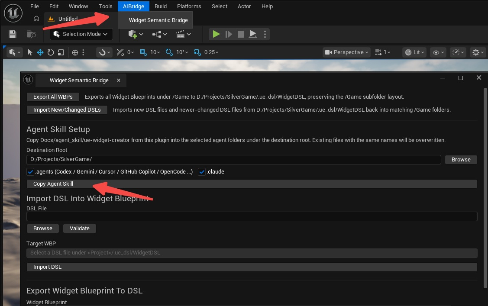
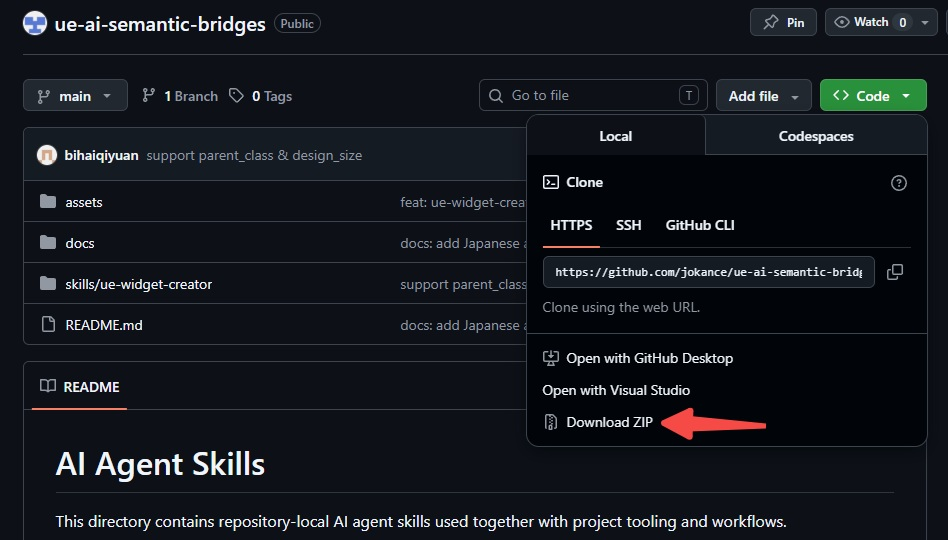

# ue-widget-creator ガイド

このドキュメントでは、`ue-widget-creator` skill と `WidgetSemanticBridge` プラグインを組み合わせて使い、AI Agent が静的 UI、ウィジェットアニメーション DSL を生成し、検証、プレビュー、UMG Widget Blueprint へのインポートまで行う方法を説明します。


## これは何か

`ue-widget-creator` は AI Agent 向けに設計されたワークフロー skill です。

これは Unreal のランタイムコードではなく、単体のプラグインでもありません。目的は、AI Agent に次の作業を行わせるための指針を与えることです。

- UI 要件を分析する
- 要件をサポート済みの `.widgetdsl` に変換する
- 生成内容を `WidgetSemanticBridge` がサポートするウィジェット、プロパティ、スロット、アニメーショントラックの範囲内に保つ
- `animation` / `track` セクションを生成または編集する
- インポート前に検証とプレビューを実行する
- 検証済み DSL を Unreal 内の実際の `WBP_*` アセットとしてインポートする

## WidgetSemanticBridge との関係

この構成は 2 つの要素で成り立っています。

- `WidgetSemanticBridge`: 検証、プレビュー、インポートを担当する [Unreal Editor プラグイン](https://www.fab.com/listings/92270793-0b09-406a-81b9-d6f9f307044f)
- `ue-widget-creator`: 要件分析と DSL 生成ワークフローを担当する AI Agent skill

プラグインが実作業を実行し、skill がワークフローを定義します。

## ゲーム UI 開発をどう改善するか

ゲームプロジェクトでは、ゲームプレイ、バランス、ビジュアルデザインの変更に合わせて UI を何度も調整する必要があります。`WidgetSemanticBridge` プラグインと `ue-widget-creator` を組み合わせることで、「要件を説明する -> DSL を生成する -> 検証 / プレビューする -> Blueprint にインポートする」という流れを繰り返し実行できるワークフローにでき、手作業で UMG を組んだりエディタを何度も操作したりする時間を大きく減らせます。

主な利点は次のとおりです。

- インベントリ、メインメニュー、クエストパネル、ポップアップなどの UI プロトタイプをより速く作成できる
- デザインモック、スケッチ、文章による要件を、インポート可能な Widget Blueprint により速く変換でき、実装時の情報ロスを減らせる
- レイアウトと一部のアニメーションが `.widgetdsl` テキストとして表現されるため、AI が UI 記述を理解、生成、修正しやすくなり、UI インタラクション、状態変化、画面フローの調整を高速に反復できる
- 生成または再エクスポートされた DSL は、AI による UI ロジック作成にも利用できる。WBP を変更した後に DSL を再度エクスポートすれば、AI が変更後の UI に合わせてロジックを更新できるため、UI コードを一行ずつ手書きする必要を減らせる。特に Lua、TypeScript、Python などのスクリプト言語と相性がよく、C++ や Blueprint よりも AI が速く反復しやすい
- インポート前の検証とプレビューにより、未対応のウィジェット、プロパティ、レイアウト上の問題を早い段階で発見でき、手戻りを減らせる
- `.widgetdsl` ファイルの一括生成や一括変更は、チーム作業や自動化ワークフローに適しており、UI アセットをバージョン管理しやすい
- UI の構造的な作業をプラグインと skill に任せることで、開発者はゲームプレイロジック、インタラクションの磨き込み、ランタイム挙動の実装により多くの時間を使える

## インストール

### 1. プラグインをインストールする

プラグインリンク: [WidgetSemanticBridge](https://www.fab.com/listings/92270793-0b09-406a-81b9-d6f9f307044f)

プラグインを Fab から入手する場合、通常は `Install to Engine` で Unreal Engine ディレクトリにインストールします。

`WidgetSemanticBridge` は次の 2 つのインストール方式をサポートしています。

- プロジェクトプラグイン: `<Project>/Plugins/WidgetSemanticBridge`
- エンジンプラグイン: `<Engine>/Plugins/.../WidgetSemanticBridge`

インストール後、プロジェクトでプラグインを有効化します。Unreal Editor で `Edit` -> `Plugins` を開き、`WidgetSemanticBridge` を見つけて有効にしてください。

### 2. skill を配置する

Unreal Editor で `AIBridge` -> `Widget Semantic Bridge` を開き、`Agent Skill Setup` を使って、プラグインに同梱されている skill をプロジェクトへコピーします。デフォルトの `Destination Root` はプロジェクトルートですが、`Browse` をクリックして別のフォルダを選択することもできます。



使用する Agent ツールに合わせて対象を選択してください。

- Codex / Gemini CLI / Cursor / GitHub Copilot / OpenCode、およびその他の `AGENTS.md` 互換 Agent ツール: `.agents/skills/ue-widget-creator/`
- Claude Code: `.claude/skills/ue-widget-creator/`

GitHub から ZIP ファイルを直接ダウンロードし、展開したあと、`ue-widget-creator` ディレクトリを対応する `skills` ディレクトリへコピーすることもできます。



チームメンバーや自動化環境が同じワークフロー指示を共有できるよう、プロジェクトリポジトリ内に置くことを推奨します。

## ディレクトリ構成

典型的な構成は次のようになります。

```text
.agents/
  skills/
    ue-widget-creator/
      SKILL.md
      references/
      scripts/
```

## 適したユースケース

適している用途:

- テキスト要件、デザインモック、スケッチから UMG UI を生成する
- デザイン画像や文章仕様をもとに `.widgetdsl` を書く
- 既存の `.widgetdsl` を修正する
- サポート済みウィジェット向けにアニメーショントラックを生成または編集する
- インポート前に、ウィジェット、プロパティ、アニメーショントラックがサポートされているか確認する
- DSL ファイルを一括で検証し、Widget Blueprint にインポートする

適していない用途:

- Event Graph の生成
- ランタイムバインディングやデリゲート
- 現在のサポート範囲外にある任意のカスタムウィジェット

## AI Agent はこの skill をどう使うべきか

`Claude Code`、`Codex`、`Gemini CLI` のどれを使う場合でも、基本要件は同じです。

- Agent がプロジェクトリポジトリにアクセスできること
- Agent がローカルスクリプトや commandlet を実行できること。ただし、コマンド実行時に許可を求める場合があります

推奨ワークフロー:

1. リポジトリルートを Agent の作業ディレクトリにする
2. Agent に `ue-widget-creator` skill を使うよう明示する
3. Agent に `.widgetdsl` の生成または修正を依頼する
4. Agent にウィジェットアニメーションの生成または修正を依頼する
5. Agent に先に validate / preview を実行させる
6. Agent に DSL をインポートさせ、Widget Blueprint を生成させる

私の経験では、GPT-5.4+ モデルは他のモデルよりも優れた UI 生成結果を出しやすいです。他のモデルで期待する結果が得られない場合は、GPT-5.4+ を試してください。

### 例

```shell
cd /path/to/your/project
codex
$ue-widget-creator Create a full-screen inventory widget with a 4x7 item slot grid on the left and an item details panel on the right.
```

別の Agent ツールを使う場合も考え方は同じです。まず `ue-widget-creator` を使うことを明確に伝え、その後に UI の説明、レイアウト要件、アニメーションや Blueprint インポートが必要かどうかを指定します。

## 出力

一般的な出力は次のとおりです。

- DSL ファイル: `.ue_dsl/WidgetDSL/.../WBP_*.widgetdsl`
- アニメーション付き DSL ファイル: 同じく `.ue_dsl/WidgetDSL/.../WBP_*.widgetdsl` に保存されます
- プレビュー画像: `Saved/WidgetDSLPreview/.../*.png`
- インポート済み Blueprint: プロジェクト内の `/Game/.../WBP_*`

## エディタパネルガイド

プラグインを有効化した後、メインパネルは次から開けます。

- メインメニュー: `AIBridge` -> `Widget Semantic Bridge`

既存の Widget Blueprint を 1 つだけ DSL にエクスポートしたい場合は、Content Browser で Widget Blueprint を右クリックし、`Export To Widget DSL` を使用することもできます。


パネルは主に 3 つの部分に分かれています。

### 1. Batch Export / Batch Import

上部の 2 つのボタンは、プロジェクト全体を対象にした一括操作用です。

- `Export All WBPs`: `/Game` 配下の Widget Blueprint を `<Project>/.ue_dsl/WidgetDSL` に一括エクスポートし、元の `/Game` 以下のサブフォルダ構成を保持します
- `Import New/Changed DSLs`: `<Project>/.ue_dsl/WidgetDSL` から DSL ファイルを一括インポートし、新規ファイル、または現在の Blueprint エクスポートより新しく内容が異なる DSL ファイルだけを処理します

これは、チームワークフロー、一括同期、または AI がすでに複数の `.widgetdsl` ファイルを生成している場合に便利です。

### 2. 単一ファイルインポート: `Import DSL Into Widget Blueprint`

1 つの `.widgetdsl` を Unreal の Widget Blueprint にインポートします。

- `DSL File` で対象ファイルを選択します。先に `Validate` をクリックすることを推奨します
- `Target WBP` にはインポート先が自動的に表示されます
- すべて問題ないことを確認したら、`Import DSL` をクリックします

注意: DSL ファイルは `<Project>/.ue_dsl/WidgetDSL` 配下に置く必要があります。そうでない場合、パネルは対象 Blueprint パスを自動マッピングできません。

### 3. 単一ファイルエクスポート: `Export Widget Blueprint To DSL`

既存の Widget Blueprint を `.widgetdsl` にエクスポートします。

- `Widget Blueprint` で `/Game` 配下の対象アセットを選択します
- `Output DSL File` には出力パスが自動的に表示されます
- `Export DSL` をクリックしてエクスポートを実行します

UMG で UI を手動調整した後、その結果を DSL に同期し、さらに AI に編集させたりバージョン管理に含めたりしたい場合に便利です。
